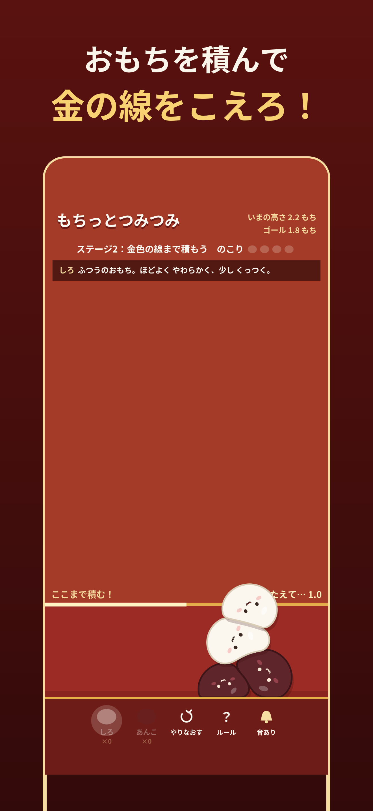
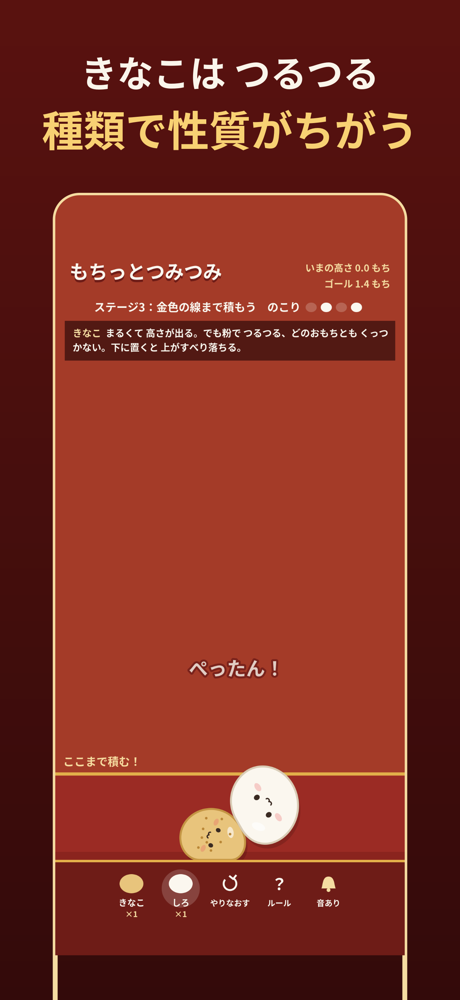
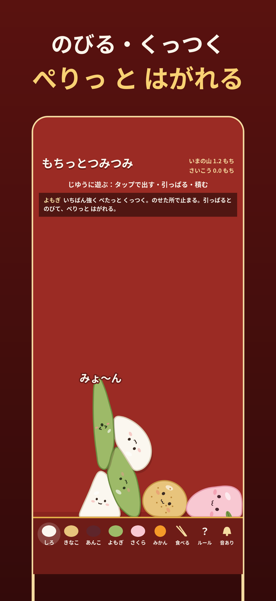
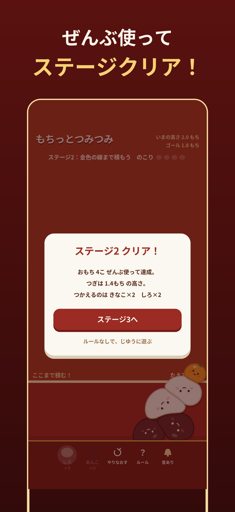

# もちっとつみつみ / Mochi Stack

An offline iOS puzzle game where you stack soft, stretchy, sticky mochi above a golden goal line.

<p>
  
  
  
  
</p>

## Features

- Soft-body physics: every mochi squishes, stretches, and sticks to its neighbors
- Five mochi types with different weight, softness, and stickiness
  - **しろ (shiro)** — the standard mochi; moderately soft and a little sticky
  - **あんこ (anko)** — small, heavy, and firm; a stable base
  - **きなこ (kinako)** — round and tall, but powdery and never sticks
  - **よもぎ (yomogi)** — the stickiest; stretches before peeling off
  - **さくら (sakura)** — light and runny; spreads flat to fill gaps
- Stage mode with hand-made and procedurally generated stages, plus a free-play sandbox
- Japanese and English (follows the device language; English everywhere else)
- Game Center leaderboards (stages cleared, free-play best)
- No ads, no in-app purchases; plays fully offline and progress is saved on the device

## How it works

The whole game (physics, rendering, UI, synthesized audio, stages) lives in a single file, [`MochittoTsumitsumi/web/index.html`](MochittoTsumitsumi/web/index.html), with no external assets or dependencies. The Swift side is a thin SwiftUI + `WKWebView` shell that adds:

- Native save storage via `UserDefaults`
- Haptic feedback
- Game Center sign-in, score submission, and the leaderboard screen
- An `.ambient` audio session so the game doesn't interrupt other audio

```
MochittoTsumitsumi.xcodeproj/   Xcode project
MochittoTsumitsumi/
  MochittoTsumitsumiApp.swift   App entry point
  GameView.swift                WKWebView wrapper and JS <-> native bridge
  GameCenter.swift              Game Center sign-in, scores, and leaderboards
  InfoPlist.xcstrings           Localized app name
  web/index.html                The entire game
AppStore/                       Store listing text and screenshots
docs/                           GitHub Pages site (support / privacy policy)
```

## Requirements

- iPhone, iOS 16.0+
- Xcode with Swift 5

## Getting started

Play in a desktop browser (no server or build step needed; progress is saved to `localStorage`):

```sh
open MochittoTsumitsumi/web/index.html
```

Append `?lang=en` (or `?lang=ja`) to the URL in the address bar to force a language.

Build for the iOS Simulator:

```sh
xcodebuild -project MochittoTsumitsumi.xcodeproj -scheme MochittoTsumitsumi \
  -destination 'generic/platform=iOS Simulator' build
```

Or open `MochittoTsumitsumi.xcodeproj` in Xcode and run.

## Links

- [Support](https://shoru-sssssaaaaaa.github.io/mochi_tsumi/)
- [Privacy policy](https://shoru-sssssaaaaaa.github.io/mochi_tsumi/privacy.html)

## License

Copyright (c) 2026 Shota Sakaguchi. All rights reserved. See [LICENSE.md](LICENSE.md).
